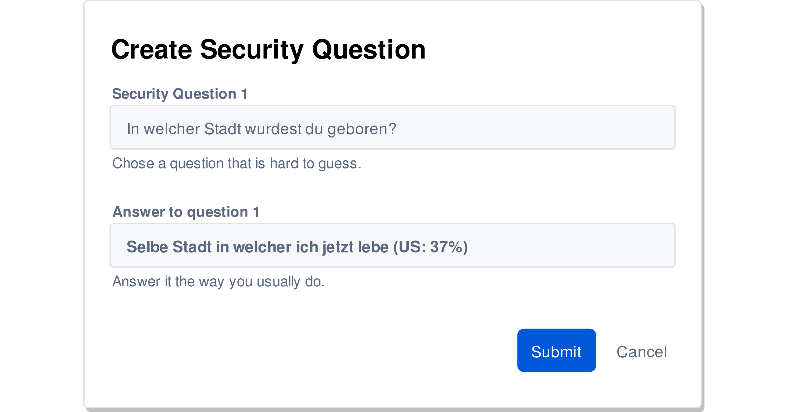

---?image=res/sand.jpg&size=cover&opacity=70
# @color[#282828](**Open Web Application Security Project**)

+++?image=res/sand.jpg&size=cover&opacity=70
## Agenda
1. Einleitung zu OWASP

2. A1 to A10
  1. Was ist A*
  2. Angriffsvektoren
  3. Demo
  4. Verteidigungsmassnahmen

3. Zusammenfassung

---?image=res/light_bulb.jpg&size=cover&opacity=60
# @color[#282828](**Einleitung**)

+++?image=res/light_bulb.jpg&size=cover&opacity=40
### Wer ist OWASP?

+++?image=res/light_bulb.jpg&size=cover&opacity=40
### Was ist das Ziel?

+++?image=res/light_bulb.jpg&size=cover&opacity=40
### Gefahrenmodell

---?image=res/injection.png&size=cover&opacity=80
# @color[#282828](**A1: Injection**)

+++?image=res/injection.png&size=cover&opacity=45
## Trend Injection 2004 - 2017
<canvas data-chart="line">
<!-- 
{
 "data": {
  "labels": [" 2004"," 2007"," 2010"," 2013"," 2017"],
  "datasets": [
   {
    "data":[5,9,10,10,10],
    "label":"Trend Injection","backgroundColor":"rgba(20,220,220,.8)"
   }
  ]
 }, 
 "options": { "responsive": true, "scales": { "xAxes": [{ "stacked": true }], "yAxes": [{ "stacked": true }] } }
}
-->
</canvas>

+++?image=res/injection.png&size=cover&opacity=45
### SQL-Interaction: User, WebApp and Server

+++?image=res/injection.png&size=cover&opacity=45
### SQL-Injection: Target and Impact

+++?image=res/injection.png&size=cover&opacity=45
### SQL-Injection: Attack

+++?image=res/injection.png&size=cover&opacity=45
## @size[1.5em](Demo Injection)
@snap[]
@snapend

@snap[]
@css[demo](**Login Bypass**)
@snapend

@snap[]
@css[demo](**Command Injection**)
@snapend

+++?image=res/injection.png&size=cover&opacity=45
## Massnahmen

+++?code=res/snippets/prepeared-statements.java&lang=java&title=Prepared Statements (Java)
@[1]
@[3-4]
@[6-7]

+++?code=res/snippets/stored-procedure.java&lang=java&title=Stored Procedures (Java)
@[1-5]
@[7]

+++?code=res/snippets/white-list.java&lang=java&title=White Listing (Java)
@[1]
@[4]
@[5-6, 8]

+++?code=res/snippets/escaping.java&lang=java&title=Escaping All User Supplied (Java)
@[2,5]
@[1]
@[4,6]

---?image=/res/broken_auth.jpg&size=cover&opacity=60
# @color[#282828](**A2: Broken Authentication**)

+++?image=/res/broken_auth.jpg&size=cover&opacity=40
## Trend Broken Authentication 2004 - 2017
@snap[graph-trend]
<canvas data-chart="line">
<!-- 
{
 "data": {
  "labels": [" 2004"," 2007"," 2010"," 2013"," 2017"],
  "datasets": [
   {
    "data":[8,4,8,9,9],
    "label":"Trend Broken Authentication","backgroundColor":"rgba(20,220,220,.8)"
   }
  ]
 }, 
 "options": { "responsive": true, "scales": { "xAxes": [{ "stacked": true }], "yAxes": [{ "stacked": true }] } }
}
-->
</canvas>
@snapend

+++?image=/res/broken_auth.jpg&size=cover&opacity=40
### Überblick

+++?image=/res/broken_auth.jpg&size=cover&opacity=40
### Brute Force

+++?image=/res/broken_auth.jpg&size=cover&opacity=40
### Passwort wiederherstellen

+++?image=/res/broken_auth.jpg&size=cover&opacity=40
### Passwort wiederherstellen

+++?image=/res/broken_auth.jpg&size=cover&opacity=40
### Passwort wiederherstellen

+++?image=/res/broken_auth.jpg&size=cover&opacity=40
### Cookie: UserID

+++?image=/res/broken_auth.jpg&size=cover&opacity=40
### Cookie: UserID

+++?image=/res/broken_auth.jpg&size=cover&opacity=40
### Session Fixation

+++?image=/res/broken_auth.jpg&size=cover&opacity=40
## @size[1.5em](Demo Broken Authentication)
@snap[]
@snapend

@snap[]
@css[demo](**Brute Force Attack**)
@snapend

@snap[]
@css[demo](**Playing with Cookies**)
@snapend

+++?image=/res/broken_auth.jpg&size=cover&opacity=40
## Massnahmen

+++?image=/res/broken_auth.jpg&size=cover&opacity=40
### Multi-Faktor Authentication

+++?image=/res/broken_auth.jpg&size=cover&opacity=40
### Session Management
@ul
- Built-In Session Manager
- Name ≠ PHPSESSID, CFID, ..)
- Länge: >128bits (BruteForce)
- starke Entropie (Zufälligkeit)
- ID Inhalt ≠ sensitive Daten
@ulend

+++?image=/res/broken_auth.jpg&size=cover&opacity=40
### Brute Force verzögern
@ul
- Verzögerung einbauen (Argon2, bcrypt, ..)
- Captcha nach x Fehlversuchen
- IP (für x Minuten) blockieren
- Account (für x Minuten) blockieren
- Reaktivierung via Mail-Link
- Einheitliche Fehlermeldung
@ulend

+++?image=/res/broken_auth.jpg&size=cover&opacity=40
### Passwörter und Sicherheitsfragen

+++?image=/res/broken_auth.jpg&size=cover&opacity=40
### Securing Cookies
