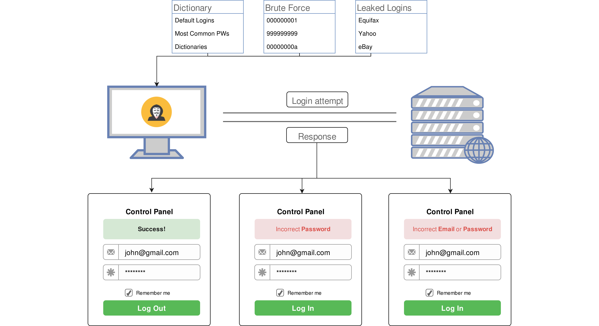

---?image=/res/owasp_logo.jpg&size=contain&color=black

---?image=res/light_bulbO60.jpg&size=cover
# @color[#282828](**Einleitung**)

+++?image=res/light_bulbO40.jpg&size=cover
### OWASP?
@ul
- Open Web Application Security Project
 
- OWASP Top 10
@ulend

+++?image=res/light_bulbO40.jpg&size=cover
- A1: Injection
- A2: Broken Authentication
- A3: Sensitive Data Exposure
- A4: XML External Entities
- A5: Broken Access Control
- A6: Security Misconfigurarion
- A7: Cross-Site Scripting
- A8: Insecure Deserialization
- A9: Using Components with Known Vulnerabilities
- A10: Insufficient Logging & Monitoring

+++?image=res/light_bulbO40.jpg&size=cover
### Gefahrenmodell (Top 10 Rating)

---?image=res/injectionO80.png&size=cover
# @color[#282828](**A1: Injection**)

+++?image=res/injectionO45.png&size=cover
### SQL-Interaction: User, WebApp and Server

Note:
- User startet Abfrage
- WebApp: Prüfung + Erstellen der Abfrage-Request
- SQL-Server: Verarbeitung Abfrage & Antwort
- Applikation rendert? Antwort

+++?image=res/injectionO45.png&size=cover
### SQL-Injection: Attack

Note:
Normal:
- Parameter eingesetzt
- Statement wie vorgesehen

Injection:
- Parameter eingesetzt
- Statement ergänzt "oder" (4=4)

+++?image=res/injectionO45.png&size=cover
### Injection: Auswirkungen

  @ul[]
  - Authentifizierung umgehen
  - Daten auslesen
  - Daten manipulieren
  - System-Übernahme
  @ulend

+++?image=res/injectionO45.png&size=cover
## Massnahmen

+++?code=res/snippets/prepeared-statements.java&lang=java&title=Prepared Statements (Java)
@[1]
@[3-4]
@[6-7]
Note:
- Prepared Statement -Objekt erstellen
- Definieren Statement
- Input in def. Statement einfügen

+++?code=res/snippets/stored-procedure.java&lang=java&title=Stored Procedures (Java)
@[1-5]
@[7]
Note:
- Server?: Statement erstellen & Definieren
- WebApp?: Aufrufen des Statements
- + Performance (cache)

+++?code=res/snippets/white-list.java&lang=java&title=White Listing (Java)
@[1]
@[5]
@[6]
@[8]
Note:
- Pattern definieren Postleitzahl
- Prüfung ob Postleitzahl Pattern entspricht
- Nicht Pattern -> Improper zipcode format
- Entspricht Pattern -> Fortgesetzt

+++?code=res/snippets/escaping.java&lang=java&title=Escaping All User Supplied Input (Java)
@[2,5, 7]
@[4,6]
Note:
- altes Statement (legacy code)
- OrcaleCode() Objekt erzeugt
- Encoder für userID und pwd anwenden

---?image=/res/broken_authO60.jpg&size=cover
# @color[#282828](**A2: Broken Authentication**)

+++?image=/res/broken_authO40.jpg&size=cover
### Überblick

Note:
- Credential Stuffing: bekannte Kombis (mail+pw)

+++?image=/res/broken_authO40.jpg&size=cover
### Brute Force

Note:
- Default Logins, Lists (Dict.+prefixes, topX, leaked), BruteForce
- Falscher Benutzer / PW
- Falsches etwas

+++?image=/res/broken_authO40.jpg&size=cover
### Passwort wiederherstellen

+++?image=/res/broken_authO40.jpg&size=cover
### Passwort wiederherstellen

+++?image=/res/broken_authO40.jpg&size=cover
### Passwort wiederherstellen

+++?image=/res/broken_authO40.jpg&size=cover
### Session Fixation

+++?image=/res/broken_authO40.jpg&size=cover
## Massnahmen

+++?image=/res/broken_authO40.jpg&size=cover
### Multi-Faktor Authentication

+++?image=/res/broken_authO40.jpg&size=cover
### Brute Force verzögern
 
@ul
- Workfactor (Argon2, bcrypt, ..)
- Captcha nach x Fehlversuchen
- IP (für x Minuten) blockieren
- Account (für x Minuten) blockieren
- Reaktivierung via Mail-Link
- Einheitliche Fehlermeldung
@ulend

+++?image=/res/broken_authO40.jpg&size=cover
### Passwörter und Sicherheitsfragen

*keine NIST Regelung

+++?image=/res/broken_authO40.jpg&size=cover
### Session Management
 
@ul
- Built-In Session Manager
- Name ≠ PHPSESSID, CFID, ..)
- Länge: >128bits (BruteForce)
- starke Entropie (Zufälligkeit)
- ID Inhalt ≠ sensitive Daten
@ulend

+++?image=/res/broken_authO40.jpg&size=cover
### Securing Cookies

---?image=/res/Data_ExposureO60.jpg&size=cover
# @color[#282828](**A3: Sensitive Data Exposure**)
Note:
- Risiko: A6 -> A3
- Daten nicht oder unzureichen Geschüzt
- Entdecken - einfach
- Auswirkungen - sensitive Daten (Gesundheit, persönliche, Kreditkarte, Zugangsdaten)

+++?image=/res/Data_ExposureO40.jpg&size=cover
### Transportierte Daten
### Gespeicherte Daten

+++?image=/res/Data_ExposureO40.jpg&size=cover
### Unverschlüsselter Traffic

Note:
- Typische unverschlüsselte Protokolle:
  - HTTP
  - POP / IMAP + SMTP
  - FTP
  - Telnet
- Daten können mitgelsen werden
  - Email, Photos, ..
  - Zugangsdaten
- Überall
  - "Intern", Kaffee, Hotel, (WLAN Zugang)
  - "Extern", Zwischen-Station; Proxy, VPN, Provider, Knotenpunkte

+++?image=/res/Data_ExposureO40.jpg&size=cover
### lately on SSL/TLS

Note:
- Nicht lesen!
  - Soll dynamik / Wandel zeigen
- Grund SSL/TLS für nicht Banking
- 2014 Heartbleed; zeigt Memorydump (sehr einfach)
- 2015: Let's Encrypt; gratis Zertifikate
- 2017: Warnung nicht verschlüsselt
  - zeige Bsp.

+++?image=/res/Data_ExposureO40.jpg&size=cover
### Heartbeat (keep-alive)

Note:
- Konzept für Demo (nachher)
- Session bricht nach x inaktiv
  - Sicherheit!
  - Browser sendet KeepAlive
- KeepAlive:
  - Client, Heartbeat-Anfrage (Zeichen+Länge)
  - Server kopiert Zeich in Memory
  - Server, Heartbeat-Antwort (Zeichen+Antwort)

+++?image=/res/Data_ExposureO40.jpg&size=cover
### Heartbeat vs Heartbleed (1)

Note:
- Zeichen können irgendetwas sein!
- Server-Antwort Logik:
  - Server liest von Memory x Zeichen
  - Sendet sie zurück (+ padding)

+++?image=/res/Data_ExposureO40.jpg&size=cover
### Heartbeat vs Heartbleed (2)

Note:
- Problem: Server überprüft nicht!
  - Client Länge > Paylouad
  - Server liest weiter
  - Sendet Daten aus dem Memory-Speicher
  - 
+++?image=/res/Data_ExposureO40.jpg&size=cover
### Misconfigured encryption (ssl-strip)

Note:
- Client ruft Webseite
  - Weiterleitung TLS
  - verschl. kein Mitlesen
- Angreifer stellt sich in Mitte
- Client unver. Angreifer vers. Webseite

+++?image=/res/Data_ExposureO40.jpg&size=cover
### Daten in Ruhe (Google)

Note:
- Google-Suche + Parameter
- (via Suche) gefundene Psyeudo(!)-Webseiten
- Paramter:
  - ext: Extension
  - intext: Vorkommen in text
  - intitle: Vorkommen im Titel
  
+++?image=/res/Data_ExposureO40.jpg&size=cover
### Daten in Ruhe (Google)

Note:
- Google-Suche + Parameter
- (via Suche) gefundene Psyeudo(!)-Webseiten
- Paramter:
  - ext: Extension
  - intext: Vorkommen in text
  - intitle: Vorkommen im Titel

+++?image=/res/Data_ExposureO40.jpg&size=cover
### Daten in Ruhe (Shodan)

Note:
- Suche nach IP ranges
- Server / Port
- Land

+++?image=/res/Data_ExposureO40.jpg&size=cover
### Daten in Ruhe (Shodan)

Note:
- Suche nach IP ranges
- Server / Port
- Land

+++?image=/res/Data_ExposureO40.jpg&size=cover
### Daten in Ruhe (Social Media)

Note:
- Veröffetnlichung sensibler Daten
  - Fotos
  - Screenshots
  - Selfies
  
+++?image=/res/Data_ExposureO40.jpg&size=cover
## Massnahmen

+++?image=/res/Data_ExposureO40.jpg&size=cover
### Daten in Transport:
@ul
- Immer verschlüsselt
- Verschlüsselung:
  - ≥TLS1.2 [Server config cheatsheet](https://cipherli.st/)
  - [SSL Labs (Test your server)](https://www.ssllabs.com/ssltest/)
- HTTP Strict Transport Security
@ulend
Note:
- Verschlüsselte Verbindungen anbieten & benutzen
- +TLS 1.2 (1.1) (Heartbleed, POODLE)
- RC4 erhebliche Sicherheitsmängel (Intägritätsschutz)
- export-grade (kürzere Schlüssel)
- Redirects SSLStrip+
- HSTS (nur über HTTPS verbinden)

+++?image=/res/Data_ExposureO40.jpg&size=cover
### Daten in Ruhe:
@ul
- Starke Verschlüsselung (AES / RSA)
- Passwörter sicher gespeichert
- Zugang absicheren
@ulend
Note:
- Stark verschl. Daten - Datenleak
- Hash: "Einweg-Funktion" - Passwortleak
- Salt: "Random-Data" (überall selbe) + Pw -> Hash - RainbowTables
- Pepper: "Radom-Data" (zufällig nicht + gespeichert) - Brute-/Dict-Attacks
- Kabel, IPs, Zonen - kleine Angriffsfläche

+++?image=/res/Data_ExposureO40.jpg&size=cover
### Daten in Ruhe (Hash)

+++?image=/res/Data_ExposureO40.jpg&size=cover
### Daten in Ruhe (Salt)

---?image=/res/xxeO40.png&size=cover
# @color[#282828](**A4: XML External Entity**)

+++?code=/res/snippets/entity-example.xml&lang=xml&lang=xml&title=Example Entity (XML)
@[1]
@[2]
@[4]
@[2,4-5]
 
@ul
Max Mustermann
@ulend
Note:
- Entity definiert
  - Entity-Name = Nachname
  - Entity-Wert = Mustermann
- Vorname = Max (harcoded)
- Nachname = Mustermann (via Entity)

+++?image=/res/xxeO10.png&size=cover
### Denial of Service

Note:
- Stichwort Rekrusion
- 2^x (Beispiel)
- allozierter Speicher

+++?code=/res/snippets/billion-laughs.xml&lang=xml&title=Billion Laughs (XML)
@[1]
@[2-11]
@[12]
@[11]
@[10-11]
@[3-11]
Note:
- Praktisches Beispiel 10
- 7^9 ~ 125MB

+++?image=/res/xxeO10.png&size=cover
### Dateien auslesen
&title=Dateien auslesen
Note:
- Definieren (injection) getFile (Entity)
- Wert / Referenzierung auf Datei
- XML Parser bettet Datei in Webseite ein
- (Leerzeichen + gewisse (spez.) Zeichen funktionieren nicht -bricht Parser, Error)

+++?code=/res/snippets/access-data.xml&lang=xml&title=Dateien auslesen (XML)
@[2]
@[2, 4]
@[2, 4-5]
Note:
- Definition Entity
  - Name = getFile
  - Wert = Referenz zu File
- Vorname = Max
- Nachname = Inhalt von File (via Entity)

+++?image=/res/xxeO10.png&size=cover
### Netzwerk-Zugang
&title=Netzwerk Zugang
Note:
- Selbe wie "Datei auslesen"
- Pfad zu Datei über Netzwerk
- Bedingungen:
  - Zugriff auf existierender Server
  - limitierte Zeichen
  - Pfad bekannte
- XML-Parser als Proxy
- Standartpfade

+++?code=/res/snippets/access-network.xml&lang=xml&title=Netzwerk Zugang (XML)
@[4]
@[4, 5]
Note:
- Definieren Entity getFile
- Referenzierung auf File
- Ausgabe via erstelltes Element <foo> ?

+++?image=/res/xxeO10.png&size=cover
### Out of band XXE

Note:
- Out-of-Band
  - Injektion Schnittstelle aber keine Ausgabe / Reflektion (Blind)
  - Umgehung der Charakter-Limitierung
- Definition:
  - lokal: getFile (holt Datei)
  - lokal: dtd (holt / importiert in send.dtd beschriebene entities)
  - remote: all (lädt / exec send)
  - remote: send (holt fiktives File von *url+Datei-Content* (von getFile) )
- Ablauf:
  - Aufruf: dtd
    - Definition all
    - Aufruf all
      - Definition send
  - Aufruf: send
    - Aufruf getFile (hole Datei Inhalt)
    - Request "attacker.ch/"+"getFile=Inhalt"

+++?image=/res/xxeO10.png&size=cover
### More on OOB XXE
[Black Hat 13 (slides)](https://media.blackhat.com/eu-13/briefings/Osipov/bh-eu-13-XML-data-osipov-slides.pdf)

+++?code=/res/snippets/oob-xxe.xml&lang=xml&title=Out of band XXE (XML)
@[1-7]
@[9-16]
@[1,4]
@[1,4-5]
@[9, 10,12]
@[12,16]
@[13]
@[7]
@[7,10,13]
Note:
- Injizierter Code (ie. Webseite)
- Hosted Attacker-Code (Attacker-Server)
- Definiere % ext (param) mit Referenz send.dtd
- Lade %ext;
- Definiere payload mit Referenz auf Datei
- Definiere all
- Führe all aus
- *Setzte Entities geschickt zusammen*
  - Definiere external mit Link+Datei-Inhalt
- Führe external aus
  - Link + Data via payload

+++?image=/res/xxeO10.png&size=cover
## Massnahmen

+++?image=/res/xxeO10.png&size=cover
### Allgemein
@ul
- DTDs (komplett) deaktivieren
 
- Alternativ, deaktivieren
  - external entities
  - external DTDs
@ulend

+++?image=/res/xxeO10.png&size=cover
### Features abstellen (Java)
#### Xerces
- /external-general-entities
- /load-external-dtd
- /disallow-doctype-decl
- /external-parameter-entities
- /load-external-dtd

+++?image=/res/xxeO10.png&size=cover
### Mehr / anwendungsbezogene Infos
<a href="https://www.owasp.org/index.php/XML_External_Entity_(XXE)_Prevention_Cheat_Sheet">XXE Prevention Cheat Sheet</a>

---?image=/res/PNGs/B-A_Control40i.png&size=cover
# @color[#282828](**A5: Broken Access Control**)

+++?image=/res/PNGs/B-A_Control20i.png&size=cover
### Zugriff durch unüberprüfter Input

Note:
- 1. Normales Surfverhalten
- 2. Bemerkt Parameter (acct)
- 3. Setzt anderer Wert
- Funktioniert, weil kein Prüfung param(wert)==user

+++?image=/res/PNGs/B-A_Control20i.png&size=cover
### Zugriff via "forced browsing"

Note:
- Selbe wie zuvor
- aber Manipulation Pfad anstatt Paramter

+++?image=/res/PNGs/B-A_Control20i.png&size=cover
### Path Traversal (Basics)
+++
Note:
- ../ == eine Stufe "Hierarchie" zurück / höher
- Ausbrechen / Zugriff auf andere Directories

+++?image=/res/PNGs/B-A_Control20i.png&size=cover
### Path Traversal (Basics)

Note:
- Man sieht Pfad (blau)
  - links: in /var/www/html
  - rechts weg zu /var/www/html
- ls zeigt Inhalt
- Pro "../" geht es eine Stufe höher vgl. Pfad

+++?image=/res/PNGs/B-A_Control20i.png&size=cover
### Path Traversal - URL (1)

Note:
- Normal (oben)
  - Klicke Link -> Request -> MP3
- Attack (unten)
  - ../ bis zum root (/)
  - zuviel "../" -> immer noch /
  - Pfad zu Datei

+++?image=/res/PNGs/B-A_Control20i.png&size=cover
### Path Traversal - URL (2)

Note:
- Selbe wei vorher
- Machmal Blacklists ".", "/", ..
- Encoding

+++?image=/res/PNGs/B-A_Control20i.png&size=cover
### Path Traversal - Cookie

Note:
- PathTrav via Referenz in Cookie
- Template (red.php, blue.php, ..) wird in Cookie gespeichert
  - normal => include /home/path/blue.php
  - attack => include /home/path/../../file

+++?image=/res/PNGs/B-A_Control20i.png&size=cover
### Client-Side Kontrollen - Hidden Field

Note:
- JavaScript client-side Kontrolle
- verstecktes (hidden) Post-Formular mit entsprechendem Wert
  - + Server Entlastung
  - - Client kann manipulieren

+++?image=/res/PNGs/B-A_Control20i.png&size=cover
## Massnahmen

+++?image=/res/PNGs/B-A_Control20i.png&size=cover
### Vertrau User Input nicht!

+++?image=/res/PNGs/B-A_Control20i.png&size=cover
### Validation
@ul
- Server-side code
- Client-side code höchstens als Ergänzung!
@ulend
Note:
- Kontollmechanismen server-sdie!
- Server-less tbd..

+++?image=/res/PNGs/B-A_Control20i.png&size=cover
### forced Browsing
@ul
- Kontroll-Mechanismus
- Überall und immer den selben KM
@ulend
Note:
- Prüfe Zugriffsrechte
- selber Mechanismus -> kleinere Angriffsfläche + Übersicht

+++?image=/res/PNGs/B-A_Control20i.png&size=cover
### Path Traversal
@ul
- Vermeide User-Input
- Whitelist / hardcoded *.ext
- Input-Validation
- set permission / policies (file-access)
@ulend

---?image=/res/PNGs/Sec-MisConf50.png&size=cover
# **A6: Security Misconfiguration**

+++?image=/res/PNGs/Sec-MisConf10.png&size=cover
### Einleitung

+++?image=/res/PNGs/Sec-MisConf10.png&size=cover
### Enumeration / default Login

+++?image=/res/PNGs/Sec-MisConf10.png&size=cover
### Error-Handling

+++?image=/res/PNGs/Sec-MisConf10.png&size=cover
### Outdated Version

+++?image=/res/PNGs/Sec-MisConf10.png&size=cover
### SOP & CORS
@ul
- Same Origin Policy
- Cross-Origin Request Sharing
@ulend

+++?image=/res/PNGs/Sec-MisConf10.png&size=cover
### Cross-Origin Request Sharing (1)

+++?image=/res/PNGs/Sec-MisConf10.png&size=cover
### Cross-Origin Request Sharing (2)

+++?image=/res/PNGs/Sec-MisConf10.png&size=cover
### CORS Misskonfigurationen (1)
Access-Control-Allow-Origin:
 
##### Supported:
@ul
- * (wildcard)
- origin (domain-name)
- origin-list-or-null
@ulend

+++?image=/res/PNGs/Sec-MisConf10.png&size=cover
### CORS Misskonfigurationen (2)
 
##### Realitiy:
@ul
- https://*.mywebsite.ch (NOT WORKING)
- one-site.ch, another-site.ch (lack of support)
@ulend

+++?image=/res/PNGs/Sec-MisConf10.png&size=cover
### CORS Misskonfigurationen (3)
#### Workarrounds
@ul
- Simple Origin Reflection
- Startswith
- Endswith
@ulend

+++?image=/res/PNGs/Sec-MisConf10.png&size=cover
#### Simple Origin Reflection

+++?image=/res/PNGs/Sec-MisConf10.png&size=cover
### Workaround: Startswith

+++?image=/res/PNGs/Sec-MisConf10.png&size=cover
### Workaround: Endswith

+++?image=/res/PNGs/Sec-MisConf10.png&size=cover
### Origin null
"[...]request is issued from a file on a user’s computer"

+++?image=/res/PNGs/Sec-MisConf10.png&size=cover
### Origin null

+++?code=res/snippets/ac_cors-iframe-sandbox.html&lang=HTML&title=iframe sandbox (null)

+++?image=/res/PNGs/Sec-MisConf10.png&size=cover
### ACA-Credentials: true
 
#### Not working
Access-Control-Allow-Origin: *
 
Access-Control-Allow-Credentials: true
 
 
#### WORKING!
Access-Control-Allow-Origin: null
 
Access-Control-Allow-Credentials: true

+++?image=/res/PNGs/Sec-MisConf10.png&size=cover
### More on CORS
[Exploiting CORS Misconfigurations](https://www.youtube.com/watch?v=wgkj4ZgxI4cT)

+++?image=/res/PNGs/B-A_Control20i.png&size=cover
### JWT - Verify-Algorhithmen

Note:
- JSON WEB TOKEN =/ cookie (Authentifizierung)
- Idee (stateless) 
  - -> Gültigkeit via Signatur
  - -> mehrere Domain / SubDomain (wenn async Sign (PubliKey))
- Header (nicht verschlüsselt), Payload, Signatur
- Symetrisch & Asymetrische Signatur
- Info via Header
- Problem
  - Header "client-controlled"
    - **set Header => (Prüfe mit HMAC-Secret oder mitRSA-Public)**
  - Symetrisch Token + set Header asymetrisch
    - Prüft Signatur mit id_rsa.pub (!)
    - nicht vertrauenswürdig -> korrekter Key = HMAC-SecretKey
  - Erstelle / Signiere eigenes symetrisches (HMAC)Token mit PublicKey (asymetrisch)
    - Prüft Signatur + set asymetrisch Header
      - Prüft Signatur mit id_rsa.pub => korrket!

+++?image=/res/PNGs/B-A_Control20i.png&size=cover
### JWT - Verify-Algorhithmen

Note:
- StepByStep
  - Hole PublicKey
  - Erstelle Payload (vgl. Dok)
  - Signier Token mit PublicKey
  - set Header "RS256" -RSA-SHA256- (asymetrisch)

+++?image=/res/PNGs/Sec-MisConf10.png&size=cover
## Massnahmen

+++?image=/res/PNGs/Sec-MisConf10.png&size=cover
### Allgemein (1)
@ul
- update!
- Security headers
- Error Messages
- Sicherheits-Features
  - Benutzen
  - Konfigurieren
@ulend

+++?image=/res/PNGs/Sec-MisConf10.png&size=cover
### Allgemein (2)
@ul
- geringste Privilegien
- unnötige Angriffsvektoren
  - Benutzerkonten
  - vergessene Server
  - Funktionen / Plugins
@ulend

+++?image=/res/PNGs/Sec-MisConf10.png&size=cover
### Web-Server
@ul
- [Verschlüsselung](https://cipherli.st/)
- [Server Token](https://www.hugeserver.com/kb/hide-apache-nginx-php-version/)
- Directory Listening
- Headers & Methoden
- Featrues
- WAF
@ulend

+++?image=/res/PNGs/Sec-MisConf10.png&size=cover
### SSH
@ul
- Root Login
- PublicKey Login
- [Fail2Ban](http://jeffskinnerbox.me/posts/2016/Apr/27/howto-install-and-configure-fail2ban/)
- [Verschlüsselung](https://stribika.github.io/2015/01/04/secure-secure-shell.html)
- [ssh-audit.py (Python)](https://github.com/arthepsy/ssh-audit)
@ulend

---?image=/res/xss-background40.png
# @color[#282828](**A7: Cross-Site Scripting**)

+++?image=/res/xss-background10.png
### Cross-Site-Scripting (XSS)

+++?image=/res/xss-background10.png
### Cross-Site-Scripting (XSS)
 
@ul
- Reflected XSS (server-basiert)
- Stored XSS (server-basiert)
- DOM / (client-basiert)
@ulend

+++?image=/res/xss-background10.png
### Reflected XSS

+++?image=/res/xss-background10.png
### Stored XSS

+++?image=/res/xss-background10.png
### DOM XSS (Fragments)

+++?image=/res/xss-background10.png
### DOM XSS (Fragments)

+++?image=/res/xss-background10.png
### MySpace Worm "Samy"

### More
[Filter Evasion](https://www.owasp.org/index.php/XSS_Filter_Evasion_Cheat_Sheet "Filter Evasion")
[misc](https://github.com/swisskyrepo/PayloadsAllTheThings/tree/master/XSS%20Injection "Various PoC, Payloads, etc")

+++?image=/res/xss-background10.png
## Massnahmen

+++?image=/res/xss-background10.png
### Vertrau Input nicht!

+++?image=/res/xss-background10.png
### Input Validation (server-side!)
@ul
- Whitelist
- Pattern
- RegEx
@ulend

+++?image=/res/xss-background10.png
### Escaping
@ul
- HTML Entity Encoding
- URL Encoding
- CSS Hex Encoding
- Sanitize HTML
  - HtmlSanitizer
  - OWASP Java HTML Sanitizer
@ulend

+++?code=/res/snippets/csp1.txt&title=Content Security Policy (CSP)

+++?code=/res/snippets/csp2.txt&title=Content Security Policy (CSP)

+++?code=/res/snippets/csp3.txt&title=Content Security Policy (CSP)

---?image=/res/serial-bg30.jpg
# @color[#282828](**A8: Insecure Deserialization**)

+++?image=/res/serial-bg10.jpg
### Was ist Serialization?

@ul
- Daten Transport (Kabel)
- Speichern von Daten
@ulend

+++?image=/res/serial-bg10.jpg
### Object Injection - Gadgets

+++?image=/res/serial-bg10.jpg
## Massnahmen

+++?image=/res/serial-bg10.jpg
### Serialization - Trust
 
@ul
- nur vertrauenswürdige Quellen!
- Entfernen der "Gadget-Klassen"
- "Lookahead" des Streams (w/b list)
@ulend

+++?image=/res/serial-bg10.jpg
### Serialization - Checks
@ul
- Integritäts-Checks (digitale Signaturen)
- Deserialization-Ausführung in low privilege env.
- Logging des. expetions and failures
- Monitoring / Restriktionen
  - In- & ausgehende Konnektivität
  - Alarm wenn konstante deserial. von user

---?image=/res/known-vuln-bg20.jpg
# @color[#282828](**A9: Using Components with Known Vulnerabilities**)

+++?image=/res/known-vuln-bg10.jpg
### Veraltete / verwundbare Komponenten

+++?image=/res/known-vuln-bg10.jpg
## Massnahmen

+++
### Unterhaltungs-Zyklus

+++?image=/res/PNGs/pythagoras-tree20.png&size=cover
### Komponenten indentifizieren
<a href="https://www.owasp.org/index.php/OWASP_Dependency_Check">Dependency Check</a>

+++?image=/res/PNGs/pythagoras-tree20.png&size=cover
### Komponenten indentifizieren
###### Sonatype Nexus IQ Server

+++?image=/res/known-vuln-bg10.jpg
### Monitoring
@ul
- Bleib dran: Vulnerabilities & Patches
  - CVE / NVD
  - Mail-Newsletter
  - Twitter-Feeds
 
- aktuelle Libraries / Komponenten
@ulend

+++?image=/res/known-vuln-bg10.jpg
### Konfiguration
@ul
- Anforderungen Prüfen
  - Konfiguration
  - Features, etc
 
- Überflüssige Funktionen

+++?image=/res/patch60.jpg
# Patch!

---?image=/res/monitor-bg30.png
# @color[#282828](**A10: Insufficient Logging & Monitoring**)

+++?image=/res/monitor-bg11.png
### Watch your logs

+++?image=/res/monitor-bg11.png
### Passende Schwellenwerte

+++?image=/res/monitor-bg11.png
### Intrusion Systems
@ul
- Intrusion Detection System (IDS)
 
- Intrusion Protection System (IPS)
 
- Typen: Host, Netzwerk & Hybrid
@ulend

+++?image=/res/monitor-bg11.png
### Host-basiertes IDS

+++?image=/res/monitor-bg11.png
### Netzwerk-basiertes IDS

+++?image=/res/monitor-bg11.png
### WAF vs IPS
@ul
- Web Application Firewall: HTTP - Layer 7
  - SSL, GET, POST, XSS, Injection, etc
 
- Intrusion Prevention System - Layer 3/4
  - DNS, SMTP, SSH, RDP, etc
@ulend

+++?image=/res/monitor-bg11.png
### Web App Firewall (WAF)
@ul
- ModSecurity
  - https://modsecurity.org/
- OWASP ModSecurity Core Rule Set
  - https://coreruleset.org/
@ul

---
# Vielen Dank für Eure Aufmerksamkeit