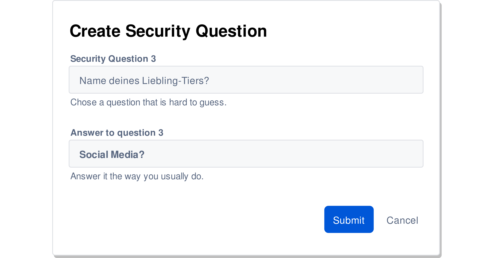

---?image=/res/owasp_logo.jpg&size=contain&color=black

---?image=res/light_bulbO60.jpg&size=cover
# @color[#282828](**Einleitung**)

+++?image=res/light_bulbO40.jpg&size=cover
### OWASP?
@ul
- Open Web Application Security Project
 
- OWASP Top 10
@ulend

+++?image=res/light_bulbO40.jpg&size=cover
- A1: Injection
- A2: Broken Authentication
- A3: Sensitive Data Exposure
- A4: XML External Entities
- A5: Broken Access Control
- A6: Security Misconfigurarion
- A7: Cross-Site Scripting
- A8: Insecure Deserialization
- A9: Using Components with Known Vulnerabilities
- A10: Insufficient Logging & Monitoring

+++?image=res/light_bulbO40.jpg&size=cover
### Gefahrenmodell (Top 10 Rating)

---?image=res/injectionO80.png&size=cover
# @color[#282828](**A1: Injection**)

+++?image=res/injectionO45.png&size=cover
### SQL-Interaction: User, WebApp and Server

Note:
- User startet Abfrage
- WebApp: Prüfung + Erstellen der Abfrage-Request
- SQL-Server: Verarbeitung Abfrage & Antwort
- Applikation rendert? Antwort

+++?image=res/injectionO45.png&size=cover
### SQL-Injection: Attack

Note:
Normal:
- Parameter eingesetzt
- Statement wie vorgesehen

Injection:
- Parameter eingesetzt
- Statement ergänzt "oder" (4=4)

+++?image=res/injectionO45.png&size=cover
### Injection: Auswirkungen

  @ul[]
  - Authentifizierung umgehen
  - Daten auslesen
  - Daten manipulieren
  - System-Übernahme
  @ulend

---?image=/res/broken_authO60.jpg&size=cover
# @color[#282828](**A2: Broken Authentication**)

+++?image=/res/broken_authO40.jpg&size=cover
### Überblick

Note:
- Credential Stuffing: bekannte Kombis (mail+pw)

+++?image=/res/broken_authO40.jpg&size=cover
### Brute Force

Note:
- Default Logins, Lists (Dict.+prefixes, topX, leaked), BruteForce
- Falscher Benutzer / PW
- Falsches etwas

+++?image=/res/broken_authO40.jpg&size=cover
### Passwort wiederherstellen

+++?image=/res/broken_authO40.jpg&size=cover
### Passwort wiederherstellen

+++?image=/res/broken_authO40.jpg&size=cover
### Passwort wiederherstellen

+++?image=/res/broken_authO40.jpg&size=cover
### Session Fixation

---?image=/res/Data_ExposureO60.jpg&size=cover
# @color[#282828](**A3: Sensitive Data Exposure**)
Note:
- Risiko: A6 -> A3
- Daten nicht oder unzureichen Geschüzt
- Entdecken - einfach
- Auswirkungen - sensitive Daten (Gesundheit, persönliche, Kreditkarte, Zugangsdaten)

+++?image=/res/Data_ExposureO40.jpg&size=cover
### Transportierte Daten
### Gespeicherte Daten

+++?image=/res/Data_ExposureO40.jpg&size=cover
### Unverschlüsselter Traffic

Note:
- Typische unverschlüsselte Protokolle:
  - HTTP
  - POP / IMAP + SMTP
  - FTP
  - Telnet
- Daten können mitgelsen werden
  - Email, Photos, ..
  - Zugangsdaten
- Überall
  - "Intern", Kaffee, Hotel, (WLAN Zugang)
  - "Extern", Zwischen-Station; Proxy, VPN, Provider, Knotenpunkte

+++?image=/res/Data_ExposureO40.jpg&size=cover
### Heartbeat (keep-alive)

Note:
- Konzept für Demo (nachher)
- Session bricht nach x inaktiv
  - Sicherheit!
  - Browser sendet KeepAlive
- KeepAlive:
  - Client, Heartbeat-Anfrage (Zeichen+Länge)
  - Server kopiert Zeich in Memory
  - Server, Heartbeat-Antwort (Zeichen+Antwort)

+++?image=/res/Data_ExposureO40.jpg&size=cover
### Heartbeat vs Heartbleed (1)

Note:
- Zeichen können irgendetwas sein!
- Server-Antwort Logik:
  - Server liest von Memory x Zeichen
  - Sendet sie zurück (+ padding)

+++?image=/res/Data_ExposureO40.jpg&size=cover
### Heartbeat vs Heartbleed (2)

Note:
- Problem: Server überprüft nicht!
  - Client Länge > Paylouad
  - Server liest weiter
  - Sendet Daten aus dem Memory-Speicher
  - 
+++?image=/res/Data_ExposureO40.jpg&size=cover
### Misconfigured encryption (ssl-strip)

Note:
- Client ruft Webseite
  - Weiterleitung TLS
  - verschl. kein Mitlesen
- Angreifer stellt sich in Mitte
- Client unver. Angreifer vers. Webseite

+++?image=/res/Data_ExposureO40.jpg&size=cover
### Daten in Ruhe (Google)

Note:
- Google-Suche + Parameter
- (via Suche) gefundene Psyeudo(!)-Webseiten
- Paramter:
  - ext: Extension
  - intext: Vorkommen in text
  - intitle: Vorkommen im Titel
  
+++?image=/res/Data_ExposureO40.jpg&size=cover
### Daten in Ruhe (Google)

Note:
- Google-Suche + Parameter
- (via Suche) gefundene Psyeudo(!)-Webseiten
- Paramter:
  - ext: Extension
  - intext: Vorkommen in text
  - intitle: Vorkommen im Titel

+++?image=/res/Data_ExposureO40.jpg&size=cover
### Daten in Ruhe (Shodan)

Note:
- Suche nach IP ranges
- Server / Port
- Land

+++?image=/res/Data_ExposureO40.jpg&size=cover
### Daten in Ruhe (Shodan)

Note:
- Suche nach IP ranges
- Server / Port
- Land

+++?image=/res/Data_ExposureO40.jpg&size=cover
### Daten in Ruhe (Social Media)

Note:
- Veröffetnlichung sensibler Daten
  - Fotos
  - Screenshots
  - Selfies

---?image=/res/xxeO40.png&size=cover
# @color[#282828](**A4: XML External Entity**)

+++?code=/res/snippets/entity-example.xml&lang=xml&lang=xml&title=Example Entity (XML)
@[1]
@[2]
@[4]
@[2,4-5]
 
@ul
Max Mustermann
@ulend
Note:
- Entity definiert
  - Entity-Name = Nachname
  - Entity-Wert = Mustermann
- Vorname = Max (harcoded)
- Nachname = Mustermann (via Entity)

+++?image=/res/xxeO10.png&size=cover
### Denial of Service

Note:
- Stichwort Rekrusion
- 2^x (Beispiel)
- allozierter Speicher

+++?image=/res/xxeO10.png&size=cover
### Dateien auslesen
&title=Dateien auslesen
Note:
- Definieren (injection) getFile (Entity)
- Wert / Referenzierung auf Datei
- XML Parser bettet Datei in Webseite ein
- (Leerzeichen + gewisse (spez.) Zeichen funktionieren nicht -bricht Parser, Error)

+++?image=/res/xxeO10.png&size=cover
### Netzwerk-Zugang
&title=Netzwerk Zugang
Note:
- Selbe wie "Datei auslesen"
- Pfad zu Datei über Netzwerk
- Bedingungen:
  - Zugriff auf existierender Server
  - limitierte Zeichen
  - Pfad bekannte
- XML-Parser als Proxy
- Standartpfade

+++?image=/res/xxeO10.png&size=cover
### Out of band XXE

Note:
- Out-of-Band
  - Injektion Schnittstelle aber keine Ausgabe / Reflektion (Blind)
  - Umgehung der Charakter-Limitierung
- Definition:
  - lokal: getFile (holt Datei)
  - lokal: dtd (holt / importiert in send.dtd beschriebene entities)
  - remote: all (lädt / exec send)
  - remote: send (holt fiktives File von *url+Datei-Content* (von getFile) )
- Ablauf:
  - Aufruf: dtd
    - Definition all
    - Aufruf all
      - Definition send
  - Aufruf: send
    - Aufruf getFile (hole Datei Inhalt)
    - Request "attacker.ch/"+"getFile=Inhalt"

---?image=/res/PNGs/B-A_Control40i.png&size=cover
# @color[#282828](**A5: Broken Access Control**)

+++?image=/res/PNGs/B-A_Control20i.png&size=cover
### Zugriff durch unüberprüfter Input

Note:
- 1. Normales Surfverhalten
- 2. Bemerkt Parameter (acct)
- 3. Setzt anderer Wert
- Funktioniert, weil kein Prüfung param(wert)==user

+++?image=/res/PNGs/B-A_Control20i.png&size=cover
### Zugriff via "forced browsing"

Note:
- Selbe wie zuvor
- aber Manipulation Pfad anstatt Paramter

+++?image=/res/PNGs/B-A_Control20i.png&size=cover
### Path Traversal (Basics)
+++
Note:
- ../ == eine Stufe "Hierarchie" zurück / höher
- Ausbrechen / Zugriff auf andere Directories

+++?image=/res/PNGs/B-A_Control20i.png&size=cover
### Path Traversal (Basics)

Note:
- Man sieht Pfad (blau)
  - links: in /var/www/html
  - rechts weg zu /var/www/html
- ls zeigt Inhalt
- Pro "../" geht es eine Stufe höher vgl. Pfad

+++?image=/res/PNGs/B-A_Control20i.png&size=cover
### Path Traversal - URL (1)

Note:
- Normal (oben)
  - Klicke Link -> Request -> MP3
- Attack (unten)
  - ../ bis zum root (/)
  - zuviel "../" -> immer noch /
  - Pfad zu Datei

+++?image=/res/PNGs/B-A_Control20i.png&size=cover
### Path Traversal - URL (2)

Note:
- Selbe wei vorher
- Machmal Blacklists ".", "/", ..
- Encoding

+++?image=/res/PNGs/B-A_Control20i.png&size=cover
### Path Traversal - Cookie

Note:
- PathTrav via Referenz in Cookie
- Template (red.php, blue.php, ..) wird in Cookie gespeichert
  - normal => include /home/path/blue.php
  - attack => include /home/path/../../file

+++?image=/res/PNGs/B-A_Control20i.png&size=cover
### Client-Side Kontrollen - Hidden Field

Note:
- JavaScript client-side Kontrolle
- verstecktes (hidden) Post-Formular mit entsprechendem Wert
  - + Server Entlastung
  - - Client kann manipulieren

---?image=/res/PNGs/Sec-MisConf50.png&size=cover
# **A6: Security Misconfiguration**

+++?image=/res/PNGs/Sec-MisConf10.png&size=cover
### Enumeration / default Login

+++?image=/res/PNGs/Sec-MisConf10.png&size=cover
### Error-Handling

+++?image=/res/PNGs/Sec-MisConf10.png&size=cover
### Outdated Version

---?image=/res/xss-background40.png
# @color[#282828](**A7: Cross-Site Scripting**)

+++?image=/res/xss-background10.png
### Cross-Site-Scripting (XSS)

+++?image=/res/xss-background10.png
### Cross-Site-Scripting (XSS)
 
@ul
- Reflected XSS (server-basiert)
- Stored XSS (server-basiert)
- DOM / (client-basiert)
@ulend

+++?image=/res/xss-background10.png
### Reflected XSS

+++?image=/res/xss-background10.png
### Stored XSS

+++?image=/res/xss-background10.png
### DOM XSS (Fragments)

+++?image=/res/xss-background10.png
### DOM XSS (Fragments)

+++?image=/res/xss-background10.png
### MySpace Worm "Samy"

---?image=/res/serial-bg30.jpg
# @color[#282828](**A8: Insecure Deserialization**)

+++?image=/res/serial-bg10.jpg
### Was ist Serialization?

@ul
- Daten Transport (Kabel)
- Speichern von Daten
@ulend

+++?image=/res/serial-bg10.jpg
### Object Injection - Gadgets

---?image=/res/known-vuln-bg20.jpg
# @color[#282828](**A9: Using Components with Known Vulnerabilities**)

+++?image=/res/known-vuln-bg10.jpg
### Veraltete / verwundbare Komponenten

+++?image=/res/known-vuln-bg10.jpg
### ExploitDB (1)

+++?image=/res/known-vuln-bg10.jpg
### ExploitDB (2)

---?image=/res/monitor-bg30.png
# @color[#282828](**A10: Insufficient Logging & Monitoring**)

+++?image=/res/monitor-bg11.png
### Watch your logs

+++?image=/res/monitor-bg11.png
### Passende Schwellenwerte

---
### Checkout the  OWASP CheatSheets
[Cheat Sheet Series](https://github.com/OWASP/CheatSheetSeries/tree/master/cheatsheets)

+++
# Vielen Dank für Eure Aufmerksamkeit